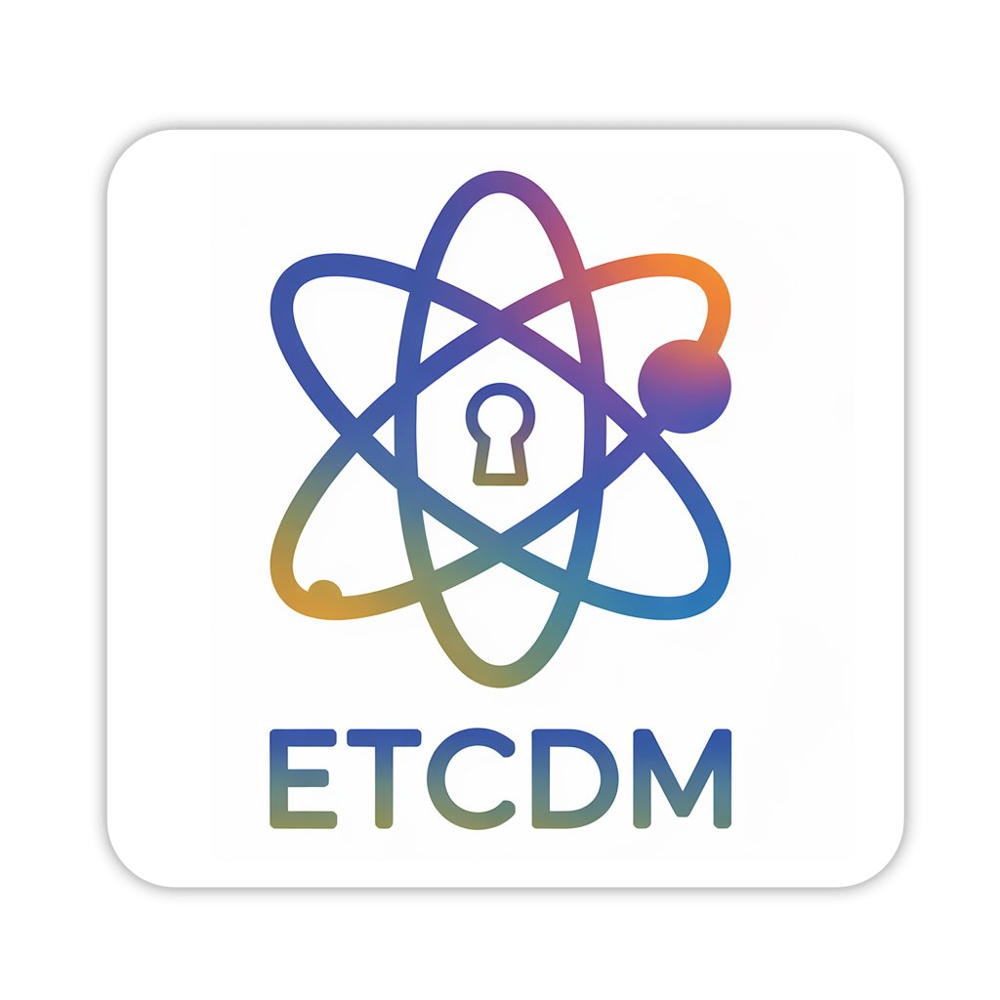
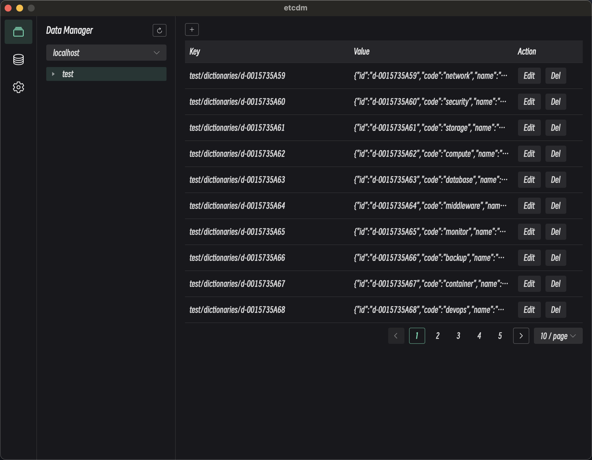
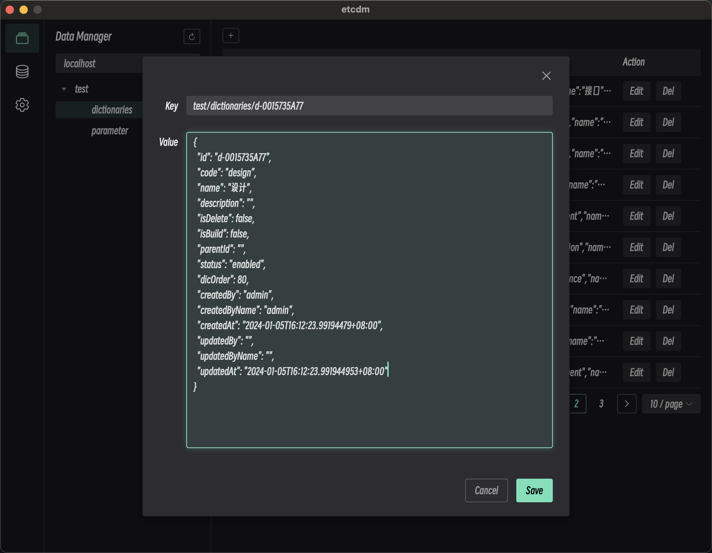

<div align="center">
<a href="https://github.com/Astronaut-X-X/etcdm/"></a>
</div>
<h1 align="center">ETCDM</h1>
<h4 align="center"><a href="https://github.com/Astronaut-X-X/etcdm/blob/main/README.md">English</a> | <strong>简体中文</strong></h4>
<div align="center">

[](https://github.com/Astronaut-X-X/etcdm/blob/main/LICENSE)
[](https://github.com/Astronaut-X-X/etcdm/releases)

[](https://github.com/Astronaut-X-X/etcdm/stargazers)
[](https://github.com/Astronaut-X-X/etcdm/fork)

<strong>ETCDM 是一个现代化的轻量级跨平台 ETCD 桌面管理工具，支持 Mac、Windows 和 Linux。</strong>
</div>

<picture>
 <source media="(prefers-color-scheme: dark)" srcset="docs/screenshots/dark_en.jpg">
 <source media="(prefers-color-scheme: light)" srcset="docs/screenshots/light_en.jpg">
 
</picture>

<picture>
 <source media="(prefers-color-scheme: dark)" srcset="docs/screenshots/dark_en2.jpg">
 <source media="(prefers-color-scheme: light)" srcset="docs/screenshots/light_en2.jpg">
 
</picture>

## 特性

* 超轻量级，基于 Webview2 构建，无内嵌浏览器（感谢 [Wails](https://github.com/wailsapp/wails)）
* 提供视觉友好的用户界面，支持明暗主题（感谢 [Naive UI](https://github.com/tusen-ai/naive-ui) 和 [IconPark](https://iconpark.oceanengine.com)）
* 可视化的键值操作，支持键值对的增删改查

## 待办

* 多语言支持
* 支持多种数据查看格式
* 支持数据导入/导出
* 支持连接配置导入/导出

## 安装

可以从[这里](https://github.com/Astronaut-X-X/etcdm/releases)免费下载。

## 构建指南

### 环境要求

* Go >= 1.23.0
* Node.js >= 16
* NPM >= 9

### 安装 Wails

```bash
go install github.com/wailsapp/wails/v2/cmd/wails@latest
```

### 构建项目
```bash
wails build
```